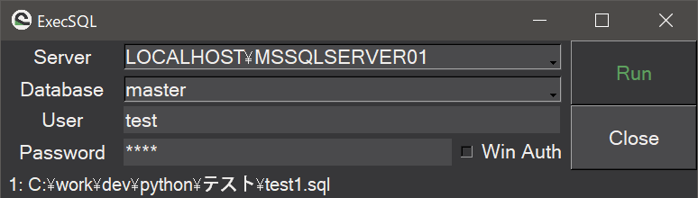

# ExecSQL

ExecSQLはsqlファイルを少ないプロセスで実行することができるツールです。

## Description

`.sql`ファイルを選択・右クリックし、コンテキストメニューの"送る"から`ExecSQL.exe`を実行することでそのSQLファイルのクエリを実行することができます。

SQLServerに対応しています。

`build.cmd`を実行することで`app`フォルダにexeが生成されます。

demo

  
## Features

- 右クリックコンテキストメニューからSQLファイルを実行
- 複数ファイル同時実行可
- 実行した.sqlがSELECT句の場合は抽出結果を表示
- SELECT結果をCSV出力

## Requirement

- Python3
- SQLServer

## Usage

1. .sqlファイルを選択して右クリック
2. `送る`からExcelSQLを実行
3. メニューにSQLServerの接続情報を入力(接続先サーバは5件まで履歴を保持)
4. `Run`ボタンを押下してSQLを実行
5. (SELECT句の場合)`Show Results`を押下することで抽出結果を表示

## Installation

https://github.com/yt3trees/ExecSQL/releases

## Author

[@yt3trees](https://twitter.com/yt3trees)

## License

[MIT](https://github.com/yt3trees/ExecSQL/blob/master/LICENSE)
